# Smol-SQL Agents Suite

## The Most Powerful Open-Source Autonomous SQL Agents

> **🎯 Mission:** Building the definitive suite of AI agents that understand, analyze, and interact with databases like senior data engineers — completely autonomously.

| Screenshot                                          | Screenshot                                          |
| --------------------------------------------------- | --------------------------------------------------- |
|  |          |
|         |  |
|  |                                                     |

### Running Front-End (React-Node)

```bash
cd web-ui/frontend
npm install
npm start
```

### Running Back-End (Flask)

```bash
cd smol-sql-agents/backend
pip install -r smol-sql-agents/backend/requirements.txt
python smol-sql-agents/backend/app.py
```

---

## 🚀 What We're Building

**Smol-SQL Agents Suite** is a collection of specialized AI agents that transform how you work with databases. Instead of writing complex SQL or digging through documentation, simply ask questions in plain English and get intelligent, validated responses.

### ⚡ Core Value Proposition

- **🧠 True Intelligence**: Our agents don't just generate SQL — they understand your business context, validate queries, and provide insights
- **🤖 Full Autonomy**: Minimal human intervention required — agents handle everything from schema discovery to query optimization  
- **🏗️ Production-Ready**: Built for real-world enterprise databases with robust error handling and state management
- **🔍 Semantic Understanding**: Vector embeddings enable natural language search across your entire database documentation

---

## 🤖 The Agent Architecture

Our suite consists of **7 specialized agents** that work together like a world-class data team:

| Agent                        | Purpose                    | Superpower                                                |
| ---------------------------- | -------------------------- | --------------------------------------------------------- |
| **🎯 Core Agent**           | Documentation orchestrator | Autonomously discovers and documents your entire database |
| **🔍 Indexer Agent**        | Semantic search engine     | Makes your database searchable in plain English           |
| **🕵️ Entity Recognition** | Database consultant        | Identifies exactly what you're looking for                |
| **💼 Business Context**     | Domain expert              | Understands your business logic and constraints           |
| **🔤 NL2SQL Agent**         | SQL translator             | Converts English to perfect, validated SQL                |
| **🔄 Integration Agent**    | Pipeline orchestrator      | Coordinates the entire query-to-result flow               |
| **⚡ Batch Manager**         | Performance optimizer      | Handles enterprise-scale operations efficiently           |

### 🧠 Core Philosophy

Every agent follows these principles:

- **Autonomous Operation** — Works independently with minimal oversight
- **Intelligent Inference** — Goes beyond simple data extraction to provide insights
- **Enterprise-Grade** — Built for production environments with comprehensive error handling
- **Semantic Understanding** — Uses AI to understand context, not just keywords
- **Collaborative Intelligence** — Agents work together, sharing knowledge and optimizing performance

---

## 🔄 Agent Architecture & Communication Flow

```mermaid
graph TB
    %% User Input
    User[👤 User Query] --> Pipeline[🔄 SQL Agent Pipeline]
    
    %% Pipeline Stages
    Pipeline --> ER[🔍 Entity Recognition Agent]
    ER --> BC[💼 Business Context Agent]
    BC --> NL2SQL[🔤 NL2SQL Agent]
    NL2SQL --> Results[📊 Query Results]
    
    %% Core Documentation Flow
    Core[📋 Core Agent] --> Indexer[🔍 Indexer Agent]
    Indexer --> VectorStore[(🗄️ Vector Store)]
    VectorStore --> ER
    VectorStore --> BC
    VectorStore --> NL2SQL
    
    %% Batch Processing
    Batch[⚡ Batch Manager] --> Indexer
    
    %% Database Connections
    DB[(🗄️ Database)] --> Core
    DB --> NL2SQL
    
    %% Shared Resources
    subgraph "Shared Resources"
        LLM[🧠 Shared LLM Model]
        DBTools[🔧 Database Tools]
        Concepts[📚 Business Concepts]
    end
    
    %% Agent Dependencies
    ER -.-> LLM
    BC -.-> LLM
    NL2SQL -.-> LLM
    Core -.-> LLM
    
    ER -.-> DBTools
    BC -.-> DBTools
    NL2SQL -.-> DBTools
    Core -.-> DBTools
    
    BC -.-> Concepts
    
    %% Data Flow
    subgraph "Data Flow"
        Schema[📋 Schema Info] --> NL2SQL
        Entities[🎯 Entity List] --> BC
        Context[💡 Business Context] --> NL2SQL
    end
    
    %% Styling
    classDef agentClass fill:#e1f5fe,stroke:#01579b,stroke-width:2px
    classDef dataClass fill:#f3e5f5,stroke:#4a148c,stroke-width:2px
    classDef resourceClass fill:#fff3e0,stroke:#e65100,stroke-width:2px
    classDef userClass fill:#e8f5e8,stroke:#1b5e20,stroke-width:2px
    
    class ER,BC,NL2SQL,Core,Indexer,Batch,Pipeline agentClass
    class VectorStore,DB,Schema,Entities,Context dataClass
    class LLM,DBTools,Concepts resourceClass
    class User,Results userClass
```



### 🎯 Agent Capabilities Matrix

| Agent                        | Primary Role                   | Key Capabilities                                        | Input                  | Output                   |
| ---------------------------- | ------------------------------ | ------------------------------------------------------- | ---------------------- | ------------------------ |
| **Core Agent**               | 📋 Documentation Orchestrator | Schema discovery, Business inference, State management  | Table names            | Structured documentation |
| **Indexer Agent**            | 🔍 Vector Operations          | Embedding generation, Semantic search, Index management | Documentation data     | Search results           |
| **Entity Recognition Agent** | 🎯 Query Analysis             | Multi-factor relevance scoring, Entity identification   | Natural language query | Applicable entities      |
| **Business Context Agent**   | 💼 Domain Guidance            | Concept matching, Join validation, Example generation   | Entities + Query       | Business context         |
| **NL2SQL Agent**             | 🔤 SQL Generation             | T-SQL conversion, Validation, Execution                 | Query + Context        | Validated SQL            |
| **Integration Agent**        | 🔄 Pipeline Orchestration     | End-to-end coordination, Error handling                 | User query             | Complete results         |
| **Batch Manager**            | ⚡ Performance Optimization    | Batch processing, Cost estimation                       | Large datasets         | Processing stats         |

### 🔗 Inter-Agent Communication

#### **Data Flow Patterns**

1. **🔍 Entity Recognition → 💼 Business Context**
   - **Data**: `applicable_entities` (table names with relevance scores)
   - **Purpose**: Provide entities for concept matching and join validation

2. **💼 Business Context → 🔤 NL2SQL**
   - **Data**: `business_instructions`, `matched_concepts`, `join_validation`
   - **Purpose**: Provide domain-specific guidance for SQL generation

3. **🔍 Indexer Agent → All Agents**
   - **Data**: Semantic search results, vector embeddings
   - **Purpose**: Enable natural language understanding across all agents

4. **📋 Core Agent → 🔍 Indexer Agent**
   - **Data**: Structured documentation (tables + relationships)
   - **Purpose**: Provide content for vector indexing and search

#### **Shared Resource Dependencies**

- **🧠 Shared LLM Model**: All agents use the same OpenAI model instance
- **🔧 Database Tools**: Unified database access across Core, NL2SQL, and Entity Recognition
- **📚 Business Concepts**: YAML-defined concepts shared by Business Context Agent

#### **Error Handling & Recovery**

- **Graceful Degradation**: Agents continue operation when dependencies are unavailable
- **State Persistence**: Processing can be interrupted and resumed
- **Fallback Mechanisms**: Alternative processing paths when primary methods fail
- **Shared Instance Recovery**: Automatic recovery of shared instances on failure

---

## Agent 1: Core Agent (`core.py`)

The central orchestrator that performs complete database introspection and generates structured documentation with AI-powered business logic inference.

### 🔄 Core Agent Architecture


###  Core Capabilities

- **🔍 Autonomous Schema Discovery**: Automatically discovers and analyzes all tables, columns, and relationships
- **🧠 Business Logic Inference**: Uses GPT-4 to determine the business purpose of tables and relationships
- **💾 Persistent State Management**: Maintains progress state with resume capability for large databases
- **📄 Multi-Format Output**: Generates documentation in Markdown and HTML formats
- **🔗 Comprehensive Relationship Mapping**: Documents all foreign key relationships with business context
- **🔍 Semantic Search Integration**: Coordinates with Indexer Agent for semantic search capabilities
- **⚡ Batch Processing Support**: Efficient processing of large databases with optimized API usage
- **🔄 Resume Capability**: Can continue interrupted processing sessions

### 🛠️ Agent Tools

The Core Agent utilizes three primary tools for database inspection:

#### `get_all_tables_unified_tool()`

- **Purpose**: Retrieve all table names from the database
- **Returns**: `Dict` - List of table names in the database with success status
- **Usage**: Initial database discovery and table enumeration

#### `get_table_schema_unified_tool(table_name: str)`

- **Purpose**: Retrieve detailed schema of a specific table
- **Parameters**: `table_name` - Name of the table to analyze
- **Returns**: `Dict` - Complete table schema information including columns, data types, constraints
- **Usage**: Deep table analysis for documentation generation

#### `get_relationships_unified_tool()`

- **Purpose**: Retrieve all foreign key relationships from the database
- **Returns**: `Dict` - List of relationship mappings with constraint details
- **Usage**: Relationship discovery and documentation

### 🔄 Core Methods

#### `process_table_documentation(table_name: str)`

Generates comprehensive documentation for a single table:

1. **Schema Analysis**: Retrieves complete table structure using `get_table_schema_unified_tool()`
2. **Business Logic Inference**: Uses GPT-4o-mini to analyze table/column names and infer business purpose
3. **Documentation Generation**: Creates structured documentation with business context
4. **Vector Indexing**: Automatically indexes documentation for semantic search
5. **State Persistence**: Saves progress to enable resume capability

**Output Format**:

```json
{
    "business_purpose": "Clear description of the table's purpose",
    "schema_data": {
        "table_name": "name",
        "columns": [...]
    }
}
```

#### `process_relationship_documentation(relationship: dict)`

Analyzes and documents database relationships:

1. **Relationship Analysis**: Examines foreign key constraints and table connections
2. **Cardinality Determination**: Identifies relationship types (one-to-one, one-to-many, many-to-many)
3. **Business Context**: Generates human-readable explanation of the relationship
4. **Vector Indexing**: Indexes relationship documentation for search

**Output Format**:

```json
{
    "relationship_type": "one-to-one|one-to-many|many-to-many",
    "documentation": "Clear explanation of the business relationship"
}
```

#### `index_processed_documents()`

Indexes all previously processed documentation:

- **Batch Processing**: Efficiently processes multiple documents
- **Vector Generation**: Creates OpenAI embeddings for semantic search
- **Error Recovery**: Handles indexing failures gracefully
- **Progress Tracking**: Monitors indexing progress and success rates

### 💡 Programmatic Usage

```python
from src.agents.core import PersistentDocumentationAgent

# Initialize the core agent
agent = PersistentDocumentationAgent()

# Process a single table
agent.process_table_documentation("users")

# Index all processed documents
agent.index_processed_documents()

# Retry vector indexing if initially unavailable
agent.retry_vector_indexing_initialization()
```

---

## Agent 2: Indexer Agent (`indexer.py`)

Intelligent vector indexing component that manages OpenAI embeddings for SQL documentation and provides semantic search capabilities.

### 🔄 Indexer Agent Architecture


### 🎯 Indexer Capabilities

- **Vector Indexing**: Creates and manages OpenAI embeddings for table and relationship documentation
- **Semantic Search**: Enables natural language queries to find relevant database entities
- **Batch Processing**: Efficiently indexes multiple documents using batch operations
- **Index Management**: Provides status monitoring and maintenance operations
- **Natural Language Interface**: Processes indexing instructions in plain English
- **ChromaDB Integration**: Uses ChromaDB for persistent vector storage with similarity search

### 🛠️ Agent Tools

#### `index_table_documentation(table_data: Dict)`

- **Purpose**: Index table documentation with OpenAI embeddings
- **Parameters**: `table_data` - Dictionary with name, business_purpose, schema, and type
- **Returns**: `Dict` - Success status and indexing details
- **Vector Dimensions**: 3072 (OpenAI text-embedding-3-small)

#### `index_relationship_documentation(relationship_data: Dict)`

- **Purpose**: Index relationship documentation with OpenAI embeddings
- **Parameters**: `relationship_data` - Dictionary with name, type, documentation, and tables
- **Returns**: `Dict` - Success status and indexing details
- **Features**: Automatic ID generation for relationships

#### `search_documentation(query: str, doc_type: str = "all")`

- **Purpose**: Search indexed documentation using OpenAI embeddings
- **Parameters**:
  - `query` - Natural language search query
  - `doc_type` - Search scope ('all', 'table', or 'relationship')
- **Returns**: `Dict` - Search results with similarity scores
- **Similarity Metric**: Cosine distance-based scoring

#### `get_indexing_status()`

- **Purpose**: Get current status of vector indexes
- **Returns**: `Dict` - Index counts and statistics
- **Metrics**: Table count, relationship count, total documents, vector dimensions

### 🔍 Search Engine Features

#### Multi-Factor Relevance Scoring

```markdown
Overall Relevance = (Semantic Similarity × 0.5) + 
                   (Business Purpose Match × 0.3) + 
                   (Table Name Relevance × 0.2)
```

#### Search Result Structure

```json
{
    "success": true,
    "query": "user authentication",
    "doc_type": "table",
    "tables": [
        {
            "content": {
                "name": "users",
                "business_purpose": "User account management",
                "schema": {...}
            },
            "score": 0.85
        }
    ],
    "relationships": [...],
    "total_results": 5
}
```

### 🔄 Indexer Methods

#### `process_indexing_instruction(instruction: str)`

Processes natural language indexing instructions:

- **Natural Language Understanding**: Interprets plain English commands
- **Operation Routing**: Determines appropriate indexing operation
- **Error Handling**: Provides detailed error messages and recovery suggestions
- **Response Validation**: Ensures proper JSON formatting and Python syntax

#### Batch Processing Methods

#### `batch_index_tables(tables_data: List[Dict])`

- **Purpose**: Efficiently index multiple tables
- **Features**: Optimized for large datasets, progress tracking
- **Returns**: `Dict[str, bool]` - Success status per table

#### `batch_index_relationships(relationships_data: List[Dict])`

- **Purpose**: Efficiently index multiple relationships  
- **Features**: Batch optimization, error recovery
- **Returns**: `Dict[str, bool]` - Success status per relationship

### 💡 Programmatic Usage

```python
from src.agents.indexer import SQLIndexerAgent
from src.vector.store import SQLVectorStore

# Initialize the indexer agent
vector_store = SQLVectorStore()
indexer_agent = SQLIndexerAgent(vector_store)

# Index table documentation
table_data = {
    "name": "users",
    "business_purpose": "Stores user account information",
    "schema": {"columns": [...]},
    "type": "table"
}
success = indexer_agent.index_table_documentation(table_data)

# Search for relevant documentation
results = indexer_agent.search_documentation("user authentication")

# Process natural language instruction
result = indexer_agent.process_indexing_instruction("Index all user-related tables")
```

---

## Agent 3: Entity Recognition Agent (`entity_recognition.py`)

Intelligent analysis agent that determines which database entities are most applicable for user queries, acting as a sophisticated database consultant.

### 🔄 Entity Recognition Agent Architecture


### 🎯 Recognition Capabilities

- **🔍 Intelligent Query Analysis**: Analyzes natural language queries to understand user intent
- **📊 Multi-Factor Relevance Scoring**: Combines semantic similarity, business purpose matching, and name relevance
- **🎯 Confidence Scoring**: Provides confidence scores for entity recommendations
- **💡 Actionable Recommendations**: Generates specific recommendations for entity usage
- **⚡ Quick Lookup**: Fast table name extraction for simple queries
- **🔍 Detailed Analysis**: Comprehensive analysis with reasoning and context
- **🚀 Optimized Performance**: Caching and parallel processing for faster results

### 🛠️ Agent Tools

#### `search_table_entities(query: str, max_results: int = 10)`

- **Purpose**: Search for table entities relevant to a user query
- **Parameters**:
  - `query` - The user query to search for relevant table entities
  - `max_results` - Maximum number of results to return
- **Returns**: `Dict` - Search results with relevant table information
- **Features**: Query validation, result limiting, error handling

### 🔄 Recognition Methods

#### `recognize_entities_optimized(user_query: str, user_intent: str = None, max_entities: int = 5)`

Optimized entity recognition with performance improvements:

- **Caching**: Results cached for repeated queries
- **Parallel Processing**: Concurrent search and analysis operations
- **Early Termination**: Quick results for high-confidence matches
- **Reduced LLM Calls**: Minimizes API usage through intelligent processing
- **Multi-Factor Analysis**: Combines semantic similarity, business purpose matching, and name relevance

**Response Structure**:

```json
{
    "success": true,
    "applicable_entities": [
        {
            "table_name": "users",
            "business_purpose": "User account management",
            "relevance_score": 0.85,
            "relevance_factors": {
                "semantic_similarity": 0.85,
                "business_purpose_match": 0.75,
                "table_name_relevance": 0.90
            },
            "recommendation": "Highly relevant - strongly recommended"
        }
    ],
    "analysis": "Direct analysis found 2 relevant entities",
    "confidence": 0.78
}
```

#### `recognize_entities(user_query: str, user_intent: str = None, max_entities: int = 5)`

Main entity recognition method that delegates to the optimized version:

- **Delegation**: Uses `recognize_entities_optimized()` for actual processing
- **Compatibility**: Maintains interface compatibility with existing code
- **Performance**: Benefits from all optimizations in the optimized version

### 💡 Programmatic Usage

```python
from src.agents.entity_recognition import EntityRecognitionAgent

# Initialize entity recognition agent
entity_agent = EntityRecognitionAgent(indexer_agent)

# Comprehensive entity recognition
results = entity_agent.recognize_entities(
    user_query="customer data management",
    user_intent="Find tables related to customer information storage",
    max_entities=5
)

# Optimized entity recognition
optimized_results = entity_agent.recognize_entities_optimized(
    user_query="customer data management",
    max_entities=10
)
```

---

## Agent 4: Business Context Agent (`business.py`)

Intelligent agent that gathers business context for user queries using YAML-defined business concepts, providing domain-specific guidance for SQL generation.

### 🔄 Business Context Agent Architecture


### 🎯 Business Context Capabilities

- **📋 Concept Management**: Loads and manages business concepts from YAML files
- **🔍 Semantic Matching**: Matches user queries to relevant business concepts
- **📊 Similarity Scoring**: Calculates semantic similarity between queries and concepts
- **💡 Example Generation**: Provides relevant examples for matched concepts
- **🔗 Join Validation**: Validates required joins against available entities
- **📈 Entity Coverage Analysis**: Analyzes concept coverage across database entities
- **🚀 Optimized Performance**: Shared concept components for faster processing

### 🛠️ Agent Tools

#### `load_concepts_for_entities(entity_names: List[str])`

- **Purpose**: Load all concepts that target the specified entities
- **Parameters**: `entity_names` - List of entity names to find concepts for
- **Returns**: `List[Dict]` - List of concept dictionaries
- **Features**: Entity-based concept filtering, error handling

#### `match_concepts_to_query(user_query: str, available_concepts: List[Dict])`

- **Purpose**: Match concepts to user query based on semantic similarity
- **Parameters**:
  - `user_query` - The user's natural language query
  - `available_concepts` - List of available concept dictionaries
- **Returns**: `List[Dict]` - List of matched concepts with similarity scores
- **Features**: Semantic similarity calculation, ranking by relevance

#### `get_concept_examples(concept_name: str, user_query: str, max_examples: int = 3)`

- **Purpose**: Get relevant examples for a specific concept
- **Parameters**:
  - `concept_name` - Name of the concept to get examples for
  - `user_query` - User's query for context
  - `max_examples` - Maximum number of examples to return
- **Returns**: `List[Dict]` - List of relevant examples with context
- **Features**: Query-aware example selection, similarity scoring

#### `validate_required_joins(entities: List[str], required_joins: List[str])`

- **Purpose**: Validate that required joins can be satisfied with available entities
- **Parameters**:
  - `entities` - List of available entities
  - `required_joins` - List of required joins from concepts
- **Returns**: `Dict` - Validation results with satisfied and unsatisfied joins
- **Features**: Join validation logic, entity availability checking

### 📋 Business Concept Structure

Business concepts are defined in YAML files with the following structure:

```yaml
concepts:
  - name: "customer_analysis"
    description: "Customer data analysis and reporting"
    target: ["customers", "accounts", "transactions"]
    required_joins: ["customers-accounts", "accounts-transactions"]
    instructions: "Use customer_id for joins, include account balances"
    examples:
      - query: "Show customer account balances"
        context: "Basic customer account information"
      - query: "Customer transaction history"
        context: "Detailed transaction analysis"
```

### 🔄 Business Context Methods

#### `gather_business_context(user_query: str, applicable_entities: List[str])`

Main business context gathering method that:

1. **Entity Analysis**: Analyzes applicable entities for concept matching
2. **Concept Loading**: Loads concepts that target the specified entities
3. **Query Matching**: Matches user query to relevant business concepts
4. **Example Selection**: Selects relevant examples for matched concepts
5. **Join Validation**: Validates required joins against available entities
6. **Response Formatting**: Formats comprehensive business context response

**Response Structure**:

```json
{
    "success": true,
    "matched_concepts": [
        {
            "name": "customer_analysis",
            "description": "Customer data analysis and reporting",
            "similarity": 0.85,
            "target_entities": ["customers", "accounts"],
            "required_joins": ["customers-accounts"]
        }
    ],
    "business_instructions": [
        {
            "concept": "customer_analysis",
            "instructions": "Use customer_id for joins, include account balances",
            "similarity": 0.85
        }
    ],
    "relevant_examples": [...],
    "join_validation": {
        "customer_analysis": {
            "valid": true,
            "satisfied_joins": ["customers-accounts"],
            "unsatisfied_joins": []
        }
    },
    "entity_coverage": {
        "entities_with_concepts": 2,
        "total_entities": 3
    }
}
```

### 💡 Programmatic Usage

```python
from src.agents.business import BusinessContextAgent

# Initialize business context agent
business_agent = BusinessContextAgent(
    indexer_agent=indexer_agent,
    concepts_dir="src/agents/concepts/examples"
)

# Gather business context for a query
context = business_agent.gather_business_context(
    user_query="show me customer account balances",
    applicable_entities=["customers", "accounts", "transactions"]
)

# Access matched concepts
matched_concepts = context.get("matched_concepts", [])
for concept in matched_concepts:
    print(f"Concept: {concept['name']}")
    print(f"Similarity: {concept['similarity']}")
    print(f"Instructions: {concept.get('instructions', '')}")
```

---

## Agent 5: NL2SQL Agent (`nl2sql.py`)

Advanced agent that converts natural language queries to T-SQL with comprehensive validation, optimization, and execution capabilities.

### 🔄 NL2SQL Agent Architecture


### 🎯 NL2SQL Capabilities

- **🔤 Natural Language Processing**: Converts natural language to T-SQL queries
- **✅ Multi-Layer Validation**: Syntax, business compliance, security, and performance validation
- **⚡ Query Execution**: Executes generated queries and returns results
- **🔧 Query Optimization**: Provides performance optimization suggestions
- **📊 Result Analysis**: Analyzes query results with sample data and statistics
- **🚀 Performance Optimization**: Caching, parallel validation, and early execution
- **🛡️ Error Prevention**: Comprehensive error handling and recovery

### 🛠️ Agent Tools

#### `execute_query_and_return_results(query: str, max_rows: int = 100)`

- **Purpose**: Execute SQL query and return results with analysis
- **Parameters**:
  - `query` - SQL query to execute
  - `max_rows` - Maximum rows to return
- **Returns**: `Dict` - Query results with sample data and statistics
- **Features**: Safe query execution, result truncation, sample data analysis

#### `final_answer(sql_query: str)`

- **Purpose**: Return the final SQL answer
- **Parameters**: `sql_query` - The final SQL query to return
- **Returns**: `Dict` - Dictionary with the final SQL query and success status
- **Features**: Standardized response format for SQL generation

#### Unified Database Tools

The NL2SQL Agent also has access to unified database tools:

- **`get_table_schema_unified_tool(table_name: str)`**: Get schema for specific table
- **`get_all_tables_unified_tool()`**: Get all available tables
- **`get_relationships_unified_tool()`**: Get all table relationships

### 🔄 NL2SQL Methods

#### `generate_sql_optimized(user_query: str, business_context: Dict, entity_context: Dict)`

Optimized SQL generation with advanced features:

1. **Comprehensive Prompting**: Builds detailed prompts with schema and business context
2. **Parallel Validation**: Runs validation checks concurrently for better performance
3. **Early Execution**: Executes queries early to catch errors quickly
4. **Caching**: Caches validation results to avoid redundant processing
5. **Error Recovery**: Handles various error scenarios gracefully

**Response Structure**:

```json
{
    "success": true,
    "generated_sql": "SELECT TOP 100 customer_id, first_name FROM customers...",
    "validation": {
        "syntax_valid": true,
        "business_compliant": true,
        "security_valid": true,
        "performance_issues": []
    },
    "query_execution": {
        "success": true,
        "total_rows": 150,
        "returned_rows": 100,
        "truncated": true,
        "sample_data": {
            "sample_rows": [...],
            "columns": [...],
            "numeric_stats": {...}
        }
    },
    "is_valid": true
}
```

#### `generate_sql(user_query: str, business_context: Dict, entity_context: Dict)`

Standard SQL generation method with full validation pipeline.

### 📊 Query Execution Features

#### Sample Data Analysis

```json
{
    "sample_data": {
        "sample_rows": [
            {"customer_id": 1, "first_name": "John", "last_name": "Smith"},
            {"customer_id": 2, "first_name": "Jane", "last_name": "Doe"}
        ],
        "columns": ["customer_id", "first_name", "last_name"],
        "numeric_stats": {
            "customer_id": {"min": 1, "max": 100, "avg": 50.5}
        }
    }
}
```

#### Performance Optimization

- **Query Complexity Analysis**: Analyzes query complexity and suggests optimizations
- **Index Recommendations**: Suggests appropriate indexes for better performance
- **Join Optimization**: Recommends optimal join strategies
- **Resource Usage**: Estimates query resource requirements

### 💡 Programmatic Usage

```python
from src.agents.nl2sql import NL2SQLAgent
from src.agents.tools.factory import DatabaseToolsFactory

# Initialize NL2SQL agent
database_inspector = DatabaseInspector()
database_tools = DatabaseToolsFactory.create_database_tools(database_inspector)
nl2sql_agent = NL2SQLAgent(database_tools)

# Generate optimized SQL
results = nl2sql_agent.generate_sql_optimized(
    user_query="show me customer accounts",
    business_context=business_context,
    entity_context=entity_context
)

# Access generated SQL
if results.get("success"):
    sql = results.get("generated_sql")
    validation = results.get("validation")
    execution_results = results.get("query_execution")
    
    print(f"Generated SQL: {sql}")
    print(f"Valid: {validation.get('syntax_valid')}")
    print(f"Rows returned: {execution_results.get('returned_rows')}")
```

---

## Agent 7: Batch Manager (`batch_manager.py`)

Optimization component that provides efficient batch processing for OpenAI embeddings generation, working with the Indexer Agent to process multiple documents simultaneously.

### 🔄 Batch Manager Architecture


### 🎯 Batch Processing Capabilities

- **Efficient Batch Processing**: Groups multiple documents into optimal batch sizes for OpenAI API calls
- **Cost Estimation**: Provides accurate cost estimates before processing large datasets
- **Progress Tracking**: Monitors processing progress with detailed statistics and logging
- **Error Recovery**: Handles failures gracefully with comprehensive error reporting
- **Resource Optimization**: Minimizes OpenAI API usage through intelligent batching strategies
- **Scalable Processing**: Handles databases with thousands of tables and relationships efficiently

### 🔄 Batch Processing Methods

#### `batch_process_pending_tables(doc_store: DocumentationStore)`

Processes multiple tables in optimized batches:

1. **Pending Item Retrieval**: Gets unprocessed tables from documentation store
2. **Batch Grouping**: Organizes tables into optimal batch sizes
3. **Data Preparation**: Prepares table documentation for batch processing
4. **Batch Execution**: Processes multiple tables per API call
5. **Progress Monitoring**: Tracks success rates and processing statistics

**Returns**: `Dict[str, bool]` - Mapping of table names to processing success status

#### `batch_process_pending_relationships(doc_store: DocumentationStore)`

Processes multiple relationships in optimized batches:

1. **Relationship Collection**: Retrieves pending relationship documentation
2. **Batch Organization**: Groups relationships for efficient processing
3. **Metadata Preparation**: Prepares relationship data for indexing
4. **Batch Processing**: Handles multiple relationships simultaneously
5. **Result Aggregation**: Combines batch results into comprehensive reports

**Returns**: `Dict[str, bool]` - Mapping of relationship IDs to processing success status

### 📊 Cost Estimation and Analytics

#### `estimate_embedding_costs(texts: List[str])`

Provides accurate OpenAI API cost estimation:

- **Token Calculation**: Estimates tokens using word count approximation
- **Pricing Model**: Uses OpenAI text-embedding-3-small pricing ($0.00002 per 1K tokens)
- **Detailed Breakdown**: Provides per-text and total cost estimates

**Returns**:

```json
{
    "total_texts": 150,
    "estimated_tokens": 12000,
    "estimated_cost_usd": 0.000240,
    "cost_per_text": 0.000002
}
```

#### `get_processing_stats(doc_store: DocumentationStore)`

Comprehensive processing statistics:

- **Pending Analysis**: Counts unprocessed tables and relationships
- **Cost Projections**: Estimates total processing costs
- **Batch Planning**: Calculates optimal batch organization
- **Resource Planning**: Provides processing time estimates

**Returns**:

```json
{
    "pending_tables": 150,
    "pending_relationships": 75,
    "total_pending": 225,
    "estimated_table_cost": 0.000180,
    "estimated_relationship_cost": 0.000090,
    "total_estimated_cost": 0.000270,
    "batch_size": 100,
    "estimated_batches": 3
}
```

### ⚙️ Optimization Features

#### Intelligent Batch Grouping

```python
def _group_into_batches(items: List, batch_size: int) -> List[List]:
    """
    Groups items into optimal batch sizes for processing efficiency.
    
    Features:
    - Dynamic batch sizing based on content complexity
    - Memory-efficient processing of large document sets
    - API optimization to minimize costs and latency
    """
```

#### Processing Pipeline

```markdown
Documentation Store → Batch Manager → Grouped Batches → Indexer Agent → OpenAI API → Vector Storage
```

1. **Data Collection**: Retrieves pending items from documentation store
2. **Batch Grouping**: Organizes items into optimal batch sizes
3. **Cost Estimation**: Calculates expected OpenAI API costs
4. **Batch Processing**: Processes multiple documents per API call
5. **Result Aggregation**: Combines results into comprehensive reports

### 💡 Programmatic Usage

```python
from src.agents.batch_manager import BatchIndexingManager

# Initialize batch manager
batch_manager = BatchIndexingManager(indexer_agent)

# Get processing statistics
stats = batch_manager.get_processing_stats(doc_store)
print(f"Estimated cost: ${stats['total_estimated_cost']:.6f}")

# Process tables in batches
table_results = batch_manager.batch_process_pending_tables(doc_store)
successful_tables = sum(1 for success in table_results.values() if success)

# Process relationships in batches
rel_results = batch_manager.batch_process_pending_relationships(doc_store)
successful_relationships = sum(1 for success in rel_results.values() if success)

# Cost estimation for specific content
texts = ["Table documentation...", "Relationship description..."]
cost_estimate = batch_manager.estimate_embedding_costs(texts)
```

---

## Agent 6: Integration Agent (`integration.py`)

The Integration Agent orchestrates the complete flow from natural language query to executable SQL, coordinating all agents for end-to-end processing.

### 🔄 Integration Agent Architecture


### 🎯 Integration Capabilities

- **🔄 End-to-End Processing**: Complete pipeline from query to validated SQL
- **🤝 Agent Coordination**: Seamlessly coordinates all specialized agents
- **📊 Comprehensive Results**: Provides detailed results from each pipeline stage
- **🛡️ Error Handling**: Robust error handling with detailed failure reporting
- **🚀 Performance Optimization**: Shared instance management for optimal performance
- **📈 Progress Tracking**: Detailed logging and progress monitoring

### 🔄 Integration Stages

#### Stage 1: Entity Recognition

```python
entity_results = self._execute_entity_recognition(user_query, user_intent)
```

- **Purpose**: Identify relevant database entities for the query
- **Agent**: Entity Recognition Agent
- **Output**: List of applicable entities with relevance scores

#### Stage 2: Business Context Gathering

```python
business_context = self._gather_business_context(user_query, entity_results)
```

- **Purpose**: Gather business context and concept matching
- **Agent**: Business Context Agent
- **Output**: Matched concepts, business instructions, and examples

#### Stage 3: SQL Generation

```python
sql_results = self._generate_sql(user_query, business_context, entity_results)
```

- **Purpose**: Generate T-SQL with validation and optimization
- **Agent**: NL2SQL Agent
- **Output**: Validated SQL with execution results

#### Stage 4: Response Formatting

```python
final_response = self._format_final_response(entity_results, business_context, sql_results)
```

- **Purpose**: Format comprehensive response with all pipeline results
- **Output**: Complete pipeline results with recommendations

### 📊 Integration Response Structure

```json
{
    "success": true,
    "pipeline_summary": {
        "entity_recognition_success": true,
        "business_context_success": true,
        "sql_generation_success": true,
        "sql_validation_success": true
    },
    "entity_recognition": {
        "entities": ["customers", "accounts"],
        "confidence": 0.85
    },
    "business_context": {
        "matched_concepts": [...],
        "business_instructions": [...]
    },
    "sql_generation": {
        "generated_sql": "SELECT TOP 100...",
        "is_valid": true,
        "validation": {...},
        "query_execution": {...}
    }
}
```

### 💡 Programmatic Usage

```python
from src.agents.integration import SQLAgentPipeline

# Initialize pipeline with shared agents
pipeline = SQLAgentPipeline(
    indexer_agent=indexer_agent,
    database_tools=database_tools,
    shared_entity_agent=entity_agent,
    shared_business_agent=business_agent,
    shared_nl2sql_agent=nl2sql_agent
)

# Process complete pipeline
results = pipeline.process_user_query(
    user_query="show me customer account balances",
    user_intent="Financial analysis for customer accounts"
)

# Access pipeline results
if results.get("success"):
    entities = results.get("entity_recognition", {}).get("entities", [])
    sql = results.get("sql_generation", {}).get("generated_sql", "")
    recommendations = results.get("recommendations", [])
    
    print(f"Recognized entities: {entities}")
    print(f"Generated SQL: {sql}")
    print(f"Recommendations: {len(recommendations)}")
```

---

## Shared Instance Management (`main.py`)

The Shared Instance Manager provides optimized performance through intelligent caching and resource sharing across all agents.

### 🎯 Shared Instance Capabilities

- **🚀 Performance Optimization**: Eliminates redundant object instantiation
- **💾 Intelligent Caching**: Caches expensive objects like LLM models and agents
- **🔄 Lazy Loading**: Initializes instances only when first accessed
- **📊 Resource Management**: Centralized management of shared resources
- **🛡️ Error Recovery**: Graceful handling of initialization failures
- **🔧 Easy Reset**: Support for testing and debugging scenarios

### 🔧 Shared Instance Manager

#### `SharedInstanceManager`

Manages all shared instances to avoid repeated instantiation costs:

```python
class SharedInstanceManager:
    def __init__(self):
        self._main_agent = None
        self._database_tools = None
        self._shared_llm_model = None
        self._entity_agent = None
        self._business_agent = None
        self._nl2sql_agent = None
        self._concept_loader = None
        self._concept_matcher = None
        self._initialized = False
```

#### Key Properties

- **`main_agent`**: Core documentation agent with indexer
- **`database_tools`**: Database connection and tools
- **`entity_agent`**: Entity recognition agent with shared LLM model
- **`business_agent`**: Business context agent with shared components
- **`nl2sql_agent`**: NL2SQL agent with shared LLM model
- **`indexer_agent`**: Indexer agent from main agent

### 📊 Performance Improvements

#### Before Shared Instances

- **LLM Model Instances**: 5 per pipeline run (1 per agent)
- **CodeAgent Instances**: 5 per pipeline run (1 per agent)
- **DatabaseTools Instances**: 3 per pipeline run (1 per function)
- **Agent Re-instantiation**: 5 agents per function call
- **Concept Components**: 2 per BusinessContextAgent

#### After Shared Instances

- **LLM Model Instances**: 1 per application lifetime ✅ **80% reduction**
- **CodeAgent Instances**: 1 per application lifetime ✅ **80% reduction**
- **DatabaseTools Instances**: 1 per application lifetime ✅ **67% reduction**
- **Agent Re-instantiation**: 0 per function call ✅ **100% elimination**
- **Concept Components**: 2 total ✅ **90% reduction**

### 💡 Programmatic Usage

```python
from main import shared_manager

# Access shared instances
main_agent = shared_manager.main_agent
database_tools = shared_manager.database_tools
entity_agent = shared_manager.entity_agent
business_agent = shared_manager.business_agent
nl2sql_agent = shared_manager.nl2sql_agent

# Use in pipeline functions
def generate_sql_from_natural_language(query: str, intent: str = None):
    # Use shared instances instead of creating new ones
    main_agent = shared_manager.main_agent
    database_tools = shared_manager.database_tools
    entity_agent = shared_manager.entity_agent
    business_agent = shared_manager.business_agent
    nl2sql_agent = shared_manager.nl2sql_agent
    
    # Process pipeline with shared instances
    # ... pipeline logic ...
```

---

## 🔗 Complete Agent Integration Workflow

All agents work together seamlessly to provide a comprehensive database documentation and SQL generation solution:

### Complete Processing Pipeline


### Agent Coordination

1. **Core Agent** orchestrates the entire documentation process
2. **Entity Recognition Agent** identifies relevant database entities for queries
3. **Business Context Agent** provides domain-specific guidance and concept matching
4. **NL2SQL Agent** converts natural language to validated T-SQL
5. **Indexer Agent** handles all vector operations and semantic search
6. **Batch Manager** optimizes processing for large-scale operations
7. **Integration Agent** coordinates all agents for end-to-end processing

### Inter-Agent Communication

- **Integration → Entity Recognition**: Identifies relevant entities for user queries
- **Entity Recognition → Business Context**: Provides entities for concept matching
- **Business Context → NL2SQL**: Provides business context for SQL generation
- **NL2SQL → Database**: Executes generated queries and returns results
- **Core → Indexer**: Provides documentation for vector indexing
- **Indexer → All Agents**: Provides semantic search capabilities

### Error Handling and Recovery

Each agent includes comprehensive error handling:

- **Graceful Degradation**: Agents continue operation when dependencies are unavailable
- **State Persistence**: Processing can be interrupted and resumed
- **Error Logging**: Detailed error tracking for debugging and monitoring
- **Fallback Mechanisms**: Alternative processing paths when primary methods fail
- **Shared Instance Recovery**: Automatic recovery of shared instances on failure

### Performance Optimization

- **Shared Instance Management**: Eliminates redundant object instantiation
- **Caching Strategies**: Intelligent caching of expensive operations
- **Parallel Processing**: Concurrent operations where possible
- **Batch Operations**: Efficient processing of multiple items
- **Early Termination**: Quick results for high-confidence matches

---

*The Smol-SQL Agents Suite provides a complete solution for autonomous database documentation, intelligent query analysis, and natural language to SQL conversion through coordinated AI agent operations with optimized performance and comprehensive error handling.*