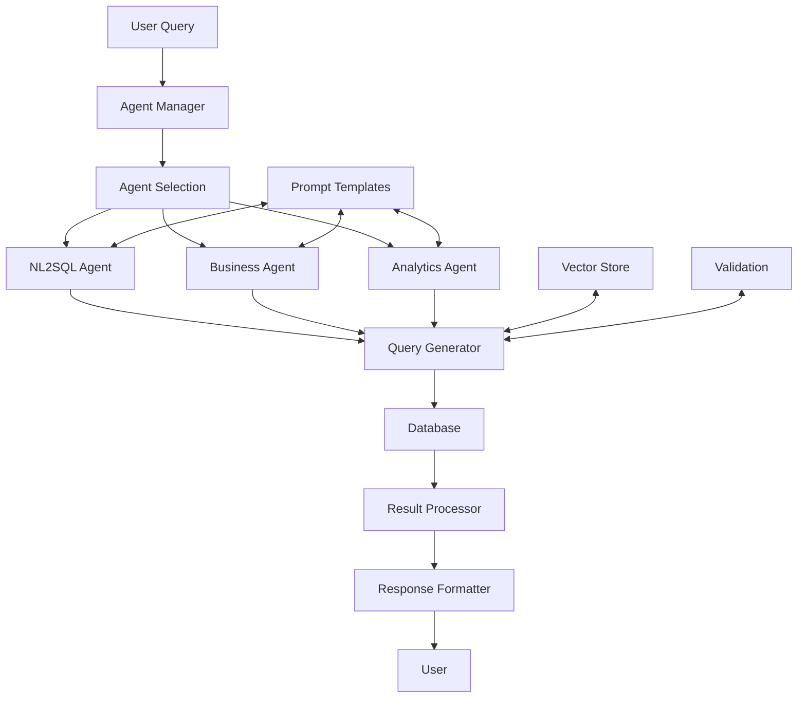

# Architecture Overview

This document provides a high-level overview of the smol-sql-agents architecture, its components, and how they interact.

## System Architecture

## Core Components

### 1. Agent Layer

- **Agent Manager**: Routes requests to appropriate agents
- **Specialized Agents**:
  - `NL2SQLAgent`: Converts natural language to SQL
  - `BusinessAgent`: Provides business insights
  - `AnalyticsAgent`: Handles data analysis tasks

### 2. Data Access Layer

- **Database Inspector**: Schema introspection and metadata
- **Query Executor**: Handles database operations
- **Connection Pool**: Manages database connections

### 3. LLM Integration

- **Prompt Management**: Template handling and rendering
- **Model Interface**: Abstraction over LLM providers
- **Response Processing**: Parsing and validating LLM outputs

### 4. Vector Operations

- **Embeddings**: Text to vector conversion
- **Similarity Search**: Finding similar content
- **Vector Store**: Storage and retrieval of embeddings

## Data Flow

1. **Request Handling**:
   - User submits a natural language query
   - Request is authenticated and validated
   - Appropriate agent is selected based on query type

2. **Query Processing**:
   - Agent generates SQL using LLM
   - Query is validated and optimized
   - Database connection is acquired from pool

3. **Execution**:
   - Query is executed against the database
   - Results are processed and formatted
   - Vector store is updated if needed

4. **Response Generation**:
   - Results are formatted for presentation
   - Additional context is added (explanations, suggestions)
   - Response is returned to the user

## Scalability Considerations

- **Horizontal Scaling**: Stateless design allows adding more instances
- **Caching**: Query results and embeddings are cached when possible
- **Async Operations**: Non-blocking I/O for database and LLM calls
- **Connection Pooling**: Efficient database connection management

## Security Model

- **Authentication**: API key or OAuth2
- **Authorization**: Role-based access control
- **Data Protection**: Encryption at rest and in transit
- **Audit Logging**: All operations are logged

## Error Handling

- **Validation Errors**: Invalid inputs are caught early
- **Retry Logic**: Transient failures are automatically retried
- **Fallback Mechanisms**: Alternative strategies when primary approach fails
- **Detailed Logging**: Comprehensive error context for debugging

## Performance Considerations

- **Query Optimization**: SQL optimization before execution
- **Batch Processing**: Handling multiple operations in single transactions
- **Resource Management**: Efficient memory and connection usage
- **Monitoring**: Performance metrics and health checks

## Integration Points

- **Databases**: PostgreSQL, MySQL, SQLite
- **Vector Stores**: Pinecone, Weaviate, FAISS
- **LLM Providers**: OpenAI, Anthropic, Local models
- **Monitoring**: Prometheus, Grafana, OpenTelemetry
