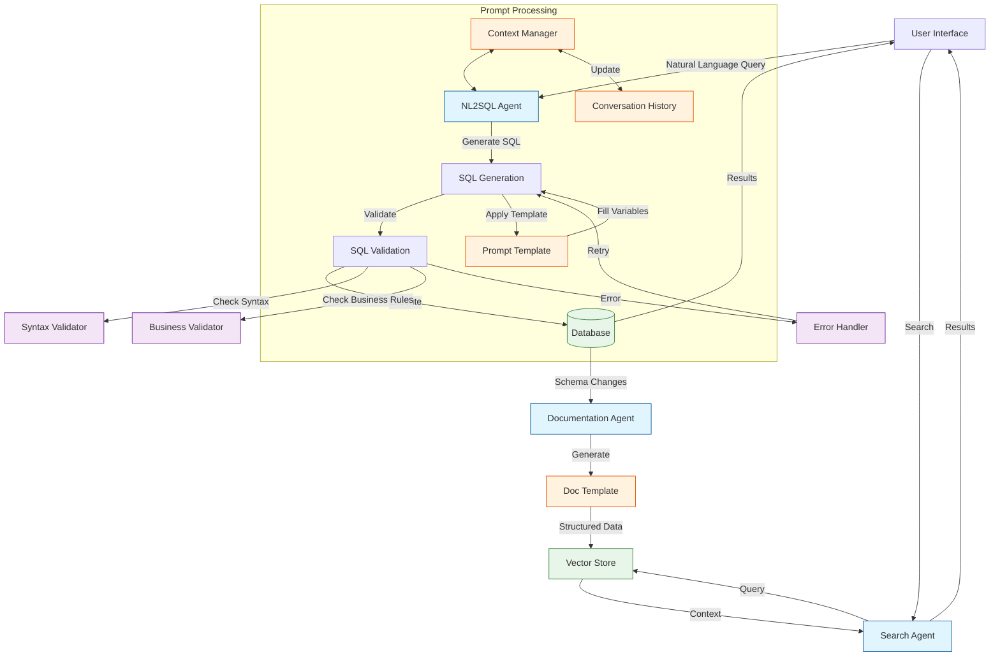

# Prompt Engineering

This guide covers prompt engineering best practices and customization options in smol-sql-agents.

## Overview

Prompts are templates that guide the LLM in generating SQL queries from natural language. The system includes a flexible prompt management system that allows for customization and versioning of prompts.

## Prompt Structure

### Core Components

1. **System Message**: Sets the behavior and role of the AI
2. **Schema Context**: Database schema information
3. **Examples**: Few-shot learning examples
4. **User Query**: The natural language input
5. **Constraints**: Rules and limitations for the output

## Default Prompts

The system includes several built-in prompt templates:

1. **sql_generation**: Converts natural language to SQL
2. **query_understanding**: Improves query interpretation
3. **result_explanation**: Explains query results
4. **error_recovery**: Handles and recovers from errors

## Customizing Prompts

### Method 1: Template Files

Create a new template file in the `prompts/templates` directory:

```jinja
# prompts/templates/custom_sql_generation.txt
You are a SQL expert. Given the following database schema:

{{ schema }}

Generate a SQL query to: {{ user_query }}

Rules:
- Only return the SQL query
- Use proper indentation
- Include comments for complex logic
```

### Method 2: Programmatic Override

```python
from smol_sql_agents.prompts import PromptManager

# Initialize with custom template directory
pm = PromptManager(template_dir="path/to/custom/templates")

# Or override specific templates
pm.register_template(
    name="custom_sql_generation",
    template_path="path/to/template.txt"
)
```

## Best Practices

### 1. Be Explicit

- Clearly specify the output format
- Include examples of desired behavior
- Define constraints and rules

### 2. Schema Context

- Include relevant table and column information
- Add descriptions for ambiguous column names
- Specify primary and foreign key relationships

### 3. Error Prevention

- Add validation rules in the prompt
- Include common error cases in examples
- Specify fallback behavior

## Advanced Techniques

### Dynamic Prompt Construction

```python
from string import Template

def build_dynamic_prompt(schema, query, examples=None):
    template = """
    Database Schema:
    $schema
    
    Examples:
    $examples
    
    Generate SQL for: $query
    """
    
    return Template(template).substitute(
        schema=schema,
        examples=examples or "No examples provided",
        query=query
    )
```

### Few-shot Learning

Include multiple examples in your prompt:

```markdown
Example 1:
Question: Find all active users
SQL: SELECT * FROM users WHERE status = 'active';

Example 2:
Question: Get total sales by product category
SQL: SELECT category, SUM(amount) FROM sales GROUP BY category;
```

## Testing Prompts

1. **Unit Testing**
   - Test with various query types
   - Verify SQL syntax correctness
   - Check handling of edge cases

2. **A/B Testing**
   - Compare performance of different prompts
   - Measure success rates
   - Collect user feedback

## Version Control

- Store prompt templates in version control
- Use semantic versioning for prompt changes
- Maintain a changelog of prompt modifications

## Prompt Architecture

### Input/Output Analysis

#### 1. SQL Generation Prompt

**Location**: `src/agents/nl2sql.py`  
**Purpose**: Converts natural language to SQL queries

**Inputs**:

- `user_query`: Natural language question/request
- `business_context`: Business rules and instructions
- `entity_context`: Database schema information

**Output Format**:

```typescript
{
  "sql": "SELECT ...",  // Generated SQL query
  "validation": {
    "is_valid": boolean,
    "errors": string[]
  }
}
```

**Key Features**:

- Schema-aware query generation
- Business rule integration
- Built-in validation
- Tool usage instructions

#### 2. Table Documentation Prompt

**Location**: `src/agents/core.py`  
**Purpose**: Generates documentation for database tables

**Inputs**:

- `table_name`: Name of the table to document
- `schema_data`: Table structure from database inspection

**Output Format**:

```typescript
{
  "business_purpose": string,
  "schema_data": {
    "table_name": string,
    "columns": string[]
  }
}
```

**Key Features**:

- Automated schema analysis
- Business context inference
- Structured JSON output
- Schema validation

#### 3. Indexing Instruction Prompt

**Location**: `src/agents/indexer.py`  
**Purpose**: Processes natural language indexing commands

**Inputs**:

- `instruction`: Natural language command
- `documentation_data`: Content to be indexed

**Output Format**:

```typescript
{
  "operation": "index" | "search" | "status",
  "target": "table" | "relationship" | "all",
  "data": any  // Operation-specific data
}
```

**Key Features**:

- Natural language command processing
- Multiple operation support
- Structured response format
- Error handling

### System Architecture with Prompt Flow



### Component Interactions

1. **NL2SQL Agent**
   - Processes natural language queries
   - Coordinates SQL generation and validation
   - Handles query execution and result formatting

2. **Documentation Agent**
   - Manages database schema documentation
   - Generates and updates table documentation
   - Maintains schema versioning

3. **Indexing Agent**
   - Handles vector embeddings
   - Manages document search
   - Maintains search indexes

4. **Support Services**
   - Business validation rules
   - T-SQL syntax validation
   - Documentation storage and retrieval

## Implementation Details

### Prompt Templates

1. **SQL Generation Template**

```sql
-- Generate T-SQL for: {user_query}
-- Schema: {schema_info}
-- Business Rules: {business_rules}

-- Instructions:
-- 1. Verify schema with get_table_schema_unified_tool()
-- 2. Test with execute_query_and_return_results()
-- 3. Return final SQL using final_answer()
```

2. **Documentation Template**

```json
{
  "instruction": "Document table: {table_name}",
  "schema": "{schema_data}",
  "requirements": [
    "business_purpose: Clear table purpose",
    "schema_data: Table structure"
  ]
}
```

3. **Indexing Template**

```json
{
  "instruction": "Process: {instruction}",
  "operations": [
    "index: Index table/relationship",
    "search: Search documentation",
    "status: Get status"
  ],
  "response_format": "JSON"
}
```

### Prompt Examples

#### SQL Generation Example

**Input**:

```python
user_query = "Show me all active customers"
```

**Prompt**:

```sql
-- Generate T-SQL for: Show me all active customers
-- Schema: customers(id, name, email, status), orders(id, customer_id, amount, order_date)
-- Business Rules: Active customers have status = 'active'

-- Instructions:
-- 1. Verify schema with get_table_schema_unified_tool()
-- 2. Test with execute_query_and_return_results()
-- 3. Return final SQL using final_answer()
```

#### Table Documentation Example

**Input**:

```python
table_name = "customers"
```

**Prompt**:

```json
{
  "instruction": "Document table: customers",
  "schema": {
    "columns": ["id", "name", "email", "status"],
    "primary_key": ["id"],
    "foreign_keys": []
  },
  "requirements": [
    "business_purpose: Clear table purpose",
    "schema_data: Table structure"
  ]
}
```

#### Indexing Example

**Input**:

```python
instruction = "Index the customers table with their latest order information"
```

**Prompt**:

```json
{
  "instruction": "Index the customers table with their latest order information",
  "operations": [
    "index: Index table/relationship",
    "search: Search documentation",
    "status: Get status"
  ],
  "response_format": "JSON"
}
```

## Common Pitfalls

1. **Overly Complex Prompts**
   - Keep prompts focused and concise
   - Break down complex tasks into smaller prompts

2. **Insufficient Context**
   - Include all necessary schema information
   - Provide clear examples

3. **Vague Instructions**
   - Be specific about output formats
   - Define expected behavior for edge cases

## Related Documentation

- [Agents](./agents.md)
- [API Reference](../api/prompts/README.md)
- [Troubleshooting Guide](../troubleshooting/common_issues.md#prompt-related-issues)
